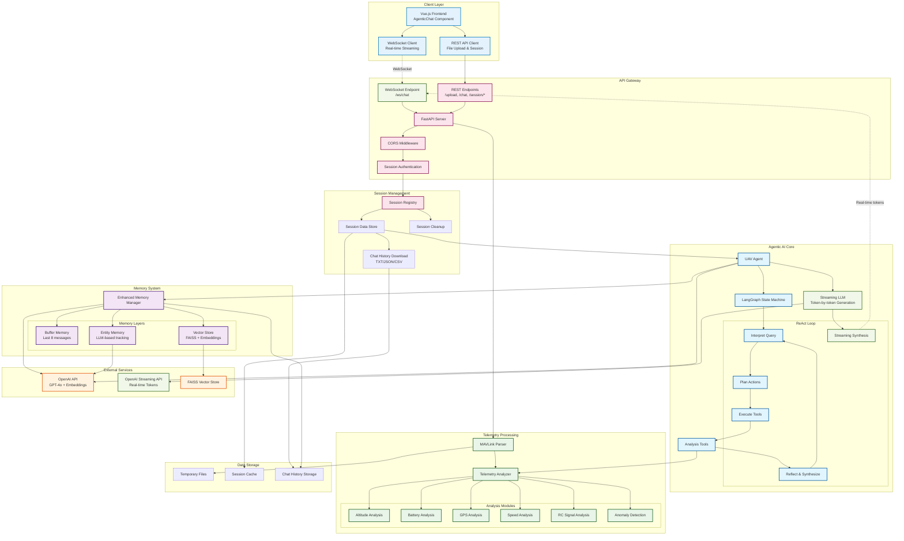

# UAV Log Viewer - Agentic Backend

A sophisticated AI-powered backend system for analyzing UAV (Unmanned Aerial Vehicle) telemetry data using advanced agentic AI architecture with multi-tiered memory management and ReAct-based reasoning.

**Agentic Chatbot Demo Video**: [Link](https://drive.google.com/file/d/1f1Fz9QSIR2i6Q-iaWyDqM0kguaa5FLgX/view?usp=sharing)

## 🚀 Overview

This backend provides intelligent analysis of MAVLink telemetry logs through an agentic AI system that can reason about flight data, detect anomalies, and provide detailed insights. The system features a multi-layered memory architecture, semantic search capabilities, and comprehensive telemetry analysis tools.

### Key Features

- **🤖 Agentic AI System**: ReAct-based reasoning agent with tool selection and execution
- **🧠 Multi-Tiered Memory**: Short & Long Agentic memory with entity tracking
- **📊 Advanced Analytics**: Comprehensive telemetry analysis with anomaly detection
- **🔍 Semantic Search**: Vector-based memory retrieval using FAISS and OpenAI embeddings
- **⚡ Real-time Processing**: Asynchronous processing with session management
- **🔒 Secure API**: Session-based authentication with CORS protection
- **📈 Comprehensive Metrics**: Flight statistics, battery analysis, GPS tracking, RC signals, and more

## 🏗️ Architecture



## 🛠️ Prerequisites

- **Python 3.10+**
- **OpenAI API Key** (for LLM and embeddings)
- **Git** (for cloning the repository)

## 📦 Installation & Setup

### 1. Clone the Repository

   ```bash
git clone https://github.com/NeuralRevenant/UAVLogViewer.git
cd UAVLogViewer/backend
```

### 2. Create Virtual Environment

   ```bash
# Create virtual environment
python -m venv venv

# Activate virtual environment
# On macOS/Linux:
source venv/bin/activate
# On Windows:
venv\Scripts\activate
```

### 3. Install Dependencies

   ```bash
   pip install -r requirements.txt
   ```

### 4. Environment Configuration

Create a `.env` file in the backend directory:

   ```bash
# Copy example environment file from the backend directory
   cp .env.example .env

# Or you can also create a new .env file from scratch
touch .env
```

Add the following environment variables to your `.env` file:

```env
# OpenAI Configuration (Required)
OPENAI_API_KEY=openai_api_key_here
OPENAI_MODEL=gpt-4o
OPENAI_EMBEDDING_MODEL=text-embedding-ada-002
OPENAI_EMBEDDING_DIMENSIONS=1536

# Server Configuration
HOST=0.0.0.0
PORT=8000

# Session Management
SESSION_TIMEOUT_MINUTES=30

# CORS Configuration
ALLOWED_ORIGINS=http://localhost:8080,http://localhost:3000
ALLOWED_METHODS=GET,POST,PUT,DELETE
ALLOWED_HEADERS=Content-Type,Accept,Origin,X-Requested-With,X-Session-ID
CORS_MAX_AGE=3600

# File Upload Configuration
TEMP_UPLOAD_DIR=temp
```

### 5. Create Required Directories

   ```bash
mkdir -p temp
   ```

### 6. Start the Server

   ```bash
# Development mode with auto-reload
python main.py

# Or using uvicorn directly
   uvicorn main:app --host 0.0.0.0 --port 8000 --reload
   ```

The server will start on `http://localhost:8000`

## 🔌 API Endpoints

### Core Endpoints

#### `POST /upload`
Upload a MAVLink log file for analysis.

**Request:**
- **Content-Type**: `multipart/form-data`
- **Body**: MAVLink log file (.bin, .tlog or .log)
- **Headers**: `X-Session-ID` (optional, creates new session if not provided)

**Response:**
```json
{
    "session_id": "uuid-string",
    "message": "Log file uploaded and processed successfully"
}
```

#### `POST /chat`
Send a message to the AI agent for analysis.

**Request:**
```json
{
    "message": "What was the highest altitude reached?",
    "session_id": "optional-session-id"
}
```

**Response:**
```json
{
    "response": "The highest altitude reached was 120.5 meters...",
    "analysis": {
        "altitude_stats": {...},
        "flight_duration": "00:15:30"
    },
    "session_id": "uuid-string"
}
```

#### `WS /ws/chat`
**Real-time streaming chat endpoint using WebSockets for token-by-token response generation.**

**Connection:**
```javascript
const ws = new WebSocket('ws://localhost:8000/ws/chat');
```

**Send Message:**
```json
{
    "message": "What was the highest altitude reached?",
    "session_id": "optional-session-id"
}
```

**Receive Streaming Response:**
```json
// Start of response
{"type": "start", "session_id": "uuid-string"}

// Token stream (multiple messages)
{"type": "token", "content": "The", "full_content": "The"}
{"type": "token", "content": " highest", "full_content": "The highest"}
{"type": "token", "content": " altitude", "full_content": "The highest altitude"}

// Final response
{
    "type": "complete",
    "content": "The highest altitude reached was 120.5 meters...",
    "analysis": {...},
    "session_id": "uuid-string"
}
```

#### `GET /sessions`
List all active sessions.

**Response:**
```json
{
    "sessions": [
        {
            "id": "session-uuid",
            "created_at": "2024-01-01T12:00:00Z",
            "last_activity": "2024-01-01T12:15:00Z",
            "has_telemetry": true
        }
    ]
}
```

#### `GET /session/messages`
Get chat messages for a session.

**Headers**: `X-Session-ID: session-uuid`

**Response:**
```json
{
    "session-uuid": [
        {
            "role": "user",
            "content": "What was the battery voltage?",
            "timestamp": "2024-01-01T12:00:00Z"
        },
        {
            "role": "assistant", 
            "content": "The battery voltage ranged from...",
            "timestamp": "2024-01-01T12:00:05Z"
        }
    ]
}
```

#### `GET /session/download`
Download chat history for the current session in various formats.

**Headers**: `X-Session-ID: session-uuid`
**Query Parameters**: `format=txt|json|csv` (default: txt)

**Response:** File download with chat history

**Example:**
```bash
curl -H "X-Session-ID: your-session-id" \
     "http://localhost:8000/session/download?format=json" \
     -o chat_history.json
```

#### `DELETE /session`
End a session and clean up resources.

**Headers**: `X-Session-ID: session-uuid`

**Response:**
```json
{
    "message": "Session ended successfully"
}
```

## 🧠 Agentic AI System

### ReAct Architecture

The system uses a **ReAct (Reasoning + Acting)** approach:

1. **🤔 Interpret**: Analyze user query and determine intent
2. **📋 Plan**: Select appropriate analysis tools
3. **⚡ Execute**: Run selected tools in parallel
4. **🔄 Reflect**: Synthesize results and determine if more analysis is needed
5. **💬 Synthesize/Respond**: Generate comprehensive answer

### Available Analysis Tools

- **`metrics`**: General telemetry metrics
- **`anomalies`**: Anomaly detection across all systems
- **`altitude_details`**: Detailed altitude analysis
- **`battery_details`**: Battery voltage, current, and consumption
- **`speed_details`**: Ground speed, air speed, and velocity analysis
- **`gps_details`**: GPS accuracy, fix status, and positioning
- **`rc_signal_details`**: RC signal strength and dropouts
- **`flight_statistics`**: Comprehensive flight summary

### 🔥 Real-time Streaming Features

#### WebSocket Streaming Chat
The system supports real-time token-by-token streaming for enhanced user experience:

- **Immediate Response**: Users see the AI's response as it's being generated
- **Live Connection Status**: WebSocket connection indicator for real-time features
- **Graceful Fallback**: Falls back to standard REST API if WebSocket unavailable
- **Session Continuity**: Maintains session state across WebSocket and REST calls

#### Chat History Export
Multiple download formats for conversation archives:

- **TXT Format**: Human-readable conversation log with timestamps
- **JSON Format**: Machine-readable format with full metadata and analysis data
- **CSV Format**: Spreadsheet-compatible format for data analysis
- **Session Isolation**: Each session's history is kept separate and secure

## 🧠 Agent Reasoning Flow Examples

The following examples demonstrate how the ReAct agent processes different types of queries:

### 🛰️ 1. Max Altitude + GPS Signal Loss
**User Query:** *"What was the max altitude and when did the GPS fail?"*

**Agent Flow:**
```
→ Interpret: User wants altitude stats + GPS failure analysis
→ Plan: [altitude_details, gps_details]
→ Execute: Run both tools in parallel (saving time with parallel processing)
→ Reflect: Both tools provided sufficient data
→ Synthesize: "Maximum altitude was 127.3m at 00:08:45. GPS signal was lost at 00:12:30 with the longest loss duration of 15 seconds."
```

### 📶 2. RC Signal Dropouts Analysis
**User Query:** *"How many times did the RC signal drop? And how long was the longest one?"*

**Agent Flow:**
```
→ Interpret: Structured telemetry question about RC signal
→ Plan: [rc_signal_details]
→ Execute: Analyze RC signal transitions
→ Reflect: All dropout data available
→ Synthesize: "RC signal dropped 3 times. Longest dropout was 8.2 seconds at 00:14:22."
```

### ⚠️ 3. Anomaly Reasoning
**User Query:** *"Are there any flight anomalies I should be aware of?"*

**Agent Flow:**
```
→ Interpret: Broad safety/anomaly inquiry
→ Plan: [anomalies]
→ Execute: Run anomaly detection across all systems
→ Reflect: Check severity and count of detected anomalies
→ Synthesize: "Found 2 anomalies: GPS accuracy spike at 00:09:15 (moderate) and altitude oscillation at 00:11:30 (low severity)."
```

### ⏱️ 4. Duration and Distance Report
**User Query:** *"How long did the flight last, and how far did it go?"*

**Agent Flow:**
```
→ Interpret: Flight statistics request
→ Plan: [flight_statistics]
→ Execute: Calculate comprehensive flight metrics
→ Reflect: Duration and distance data retrieved
→ Synthesize: "Flight duration: 15 minutes 42 seconds. Total distance: 2.8 km."
```

### 📡 5. GPS Fix Percentage
**User Query:** *"What percentage of time was GPS fix maintained?"*

**Agent Flow:**
```
→ Interpret: GPS reliability question
→ Plan: [gps_details]
→ Execute: Analyze GPS fix status over time
→ Reflect: GPS statistics calculated
→ Synthesize: "GPS fix maintained 94.2% of flight time (14m 48s of 15m 42s total)."
```

### 🛑 6. Clarification Prompt
**User Query:** *"Was everything okay?"*

**Agent Flow:**
```
→ Interpret: Too vague to determine specific analysis needed
→ Plan: [] (no tools selected)
→ Reflect: Need clarification before proceeding
→ Synthesize: "Could you specify which aspect of the flight you'd like me to examine – altitude stability, GPS accuracy, RC signal, or something else?"
```

### 🧾 7. Validate Assumed Data
**User Query:** *"You said the flight lasted 12 minutes but I see only 7."*

**Agent Flow:**
```
→ Interpret: User challenging previous data, need verification
→ Plan: [flight_statistics]
→ Execute: Re-calculate flight duration
→ Reflect: Compare with user's assertion
→ Synthesize: "According to telemetry analysis, flight duration was 7 minutes 22 seconds. You might be referring to total ground time including pre-flight checks."
```

### 📍 8. Start & End Coordinates
**User Query:** *"Where did the flight start and end?"*

**Agent Flow:**
```
→ Interpret: Geographic location query
→ Plan: [gps_details] or [flight_statistics]
→ Execute: Extract start/end coordinates
→ Reflect: Location data available
→ Synthesize: "Flight started at 37.7749°N, 122.4194°W and ended at 37.7751°N, 122.4189°W (5m displacement)."
```

### 📉 9. Flight Performance Summary
**User Query:** *"Give me a quick summary of the flight"*

**Agent Flow:**
```
→ Interpret: Comprehensive overview request
→ Plan: [flight_statistics]
→ Execute: Generate complete flight analysis
→ Reflect: All major statistics available
→ Synthesize: "15m 42s flight, max altitude 127m, avg speed 12.3 m/s, GPS fix 94.2%, 2 minor anomalies detected, RC signal stable."
```

### Memory System

#### Multi-Tiered Memory Architecture

1. **Short-term Buffer Memory**
   - Stores last 8 messages verbatim
   - Immediate context for conversation flow

2. **Long-term Vector Memory**
   - FAISS-based semantic search
   - Time-weighted retrieval
   - Importance scoring

3. **Entity Memory**
   - LLM-powered entity extraction
   - Tracks entities like altitude peaks, GPS fix transitions, and RC signal dropouts across conversation turns
   - Contextual relationship mapping

## 📊 Telemetry Analysis

### Supported Log Formats

- **MAVLink Binary Logs** (.bin)
- **MAVLink Text Logs** (.log/.tlog)
- **ULog Format** (.ulg) - PX4 format (limited support, .bin/.tlog recommended)

### Analysis Capabilities

#### Flight Metrics
- Altitude profiles and statistics
- Speed analysis (ground, air, vertical)
- Flight duration and distance
- Takeoff and landing detection

#### Battery Analysis
- Voltage curves and drops
- Current consumption patterns
- Energy usage calculations
- Battery health indicators

#### GPS Analysis
- Fix quality and accuracy
- Position drift analysis
- Satellite count tracking
- HDOP/VDOP metrics (currently not being passed to the LLM but although being extracted from the telemetry log)

#### Anomaly Detection
- Statistical outlier detection
- Pattern recognition
- Critical event identification

## 🔧 Configuration

### Environment Variables

| Variable | Default | Description |
|----------|---------|-------------|
| `OPENAI_API_KEY` | - | **Required**: OpenAI API key |
| `OPENAI_MODEL` | `gpt-4o` | OpenAI model for reasoning |
| `OPENAI_EMBEDDING_MODEL` | `text-embedding-ada-002` | Embedding model |
| `HOST` | `0.0.0.0` | Server host |
| `PORT` | `8000` | Server port |
| `SESSION_TIMEOUT_MINUTES` | `30` | Session timeout |
| `TEMP_UPLOAD_DIR` | `temp` | Upload directory |
| `ALLOWED_ORIGINS` | `http://localhost:8080` | CORS origins |

### Memory Configuration

- **Buffer Window**: 8 messages
- **Vector Retrieval**: 5 documents
- **Entity Tracking**: 15 entities
- **Importance Scoring**: Automatic based on content length and role

## 🚀 Development

### Project Structure

```
backend/
├── main.py                 # FastAPI application and endpoints
├── requirements.txt        # Python dependencies
├── .env                   # Environment variables
├── temp/                  # Temporary file uploads
├── agents/
│   └── uav_agent.py       # Main agentic AI implementation
├── chat/
│   └── memory_manager.py  # Multi-tiered memory system
└── telemetry/
    ├── parser.py          # MAVLink log parsing
    └── analyzer.py        # Telemetry analysis engine
```

### Running in Development

```bash
# With auto-reload
python main.py

# With debug logging
PYTHONPATH=. python -m uvicorn main:app --reload --log-level debug
```

## Chat Download Option
- The entire chat (during the session) can be downloaded by clicking on the "Download" button below the chatbox in the UI interface.

## 🔒 Security Features

- **Session-based authentication**: Uses X-Session-ID headers for session management
- **Session isolation**: Each session maintains separate data and memory
- **Automatic cleanup**: Expired sessions are automatically removed
- **CORS protection**: Configurable origin restrictions
- **Input validation**: Comprehensive request validation
- **Error handling**: Graceful error responses

## 📈 Performance

### Optimization Features

- **Parallel tool execution**: Multiple analysis tools run concurrently
- **Efficient memory management**: Time-weighted vector retrieval
- **Session caching**: Reuse of parsed telemetry data
- **Async processing**: Non-blocking request handling

### Resource Usage

- **Memory**: ~100-500MB per active session (depending on log size)
- **CPU**: Burst usage during analysis, idle between requests
- **Storage**: Temporary files cleaned up automatically

## 🐛 Troubleshooting

### Common Issues

1. **OpenAI API Key Error**
   ```
   Error: OpenAI API key not found
   Solution: Set OPENAI_API_KEY in .env file
   ```

2. **Memory Issues with Large Logs**
   ```
   Error: Memory allocation failed
   Solution: Increase system memory or reduce log size
   ```

3. **Session Timeout**
   ```
   Error: Session not found
   Solution: Upload log file again or increase SESSION_TIMEOUT_MINUTES
   ```

### Logging

The system provides comprehensive logging:

```bash
# View logs in real-time
tail -f logs/app.log

# Debug mode
export LOG_LEVEL=DEBUG
python main.py
```

## 🤝 Contributing

1. Fork the repository
2. Create a feature branch: `git checkout -b feature/amazing-feature`
3. Commit changes: `git commit -m 'Add amazing feature'`
4. Push to branch: `git push origin feature/amazing-feature`
5. Open a Pull Request

## 🙏 Acknowledgments & Technologies Used

* **🛰 MAVLink** –
  Lightweight messaging protocol for communicating with drones; used as the telemetry data standard for parsing `.tlog` files.

* **🧠 OpenAI (GPT-4o, ada-002)** –
  Powering the agent’s reasoning (`gpt-4o`) and semantic memory embeddings (`text-embedding-ada-002`) for both planning and answer generation.

* **🦜 LangChain** –
  Used for tool abstraction, agent orchestration (`BaseTool`, `ChatOpenAI`), and memory integration (Buffer, FAISS, Entity, CombinedMemory).

* **⚡ FastAPI** –
  Fast, async-ready Python web framework powering the backend API and WebSocket chat streaming.

* **🔍 FAISS (Facebook AI Similarity Search)** –
  High-performance similarity search for time-weighted memory retrieval and context-aware long-term recall.

* **📈 pandas & numpy** –
  Backbone of all telemetry data processing, statistical analysis, and time-series metric computation.

* **🧰 scikit-learn (IsolationForest)** –
  Used for anomaly detection in UAV signal metrics (e.g., voltage drops, GPS fix instability, RC link losses).

* **📚 Pydantic** –
  For request/response validation and serialization in FastAPI endpoints.

* **🌐 HTTPX** –
  Async HTTP client for OpenAI API calls, streaming completions, and retry-resilient embedding generation.

* **🧪 watchfiles** –
  Dev-time hot-reloading of FastAPI and agent modules with minimal latency.

* **🔧 dotenv & os** –
  For clean environment management and configuration loading across API and agent layers.

* **🔄 LangGraph** –
  Graph-based agentic planning and execution pipeline with support for conditional branching (`StateGraph`, `ainvoke`).

* **🗃 JSON & Regex** –
  Used extensively for prompt I/O extraction, sanitization, and handling LangChain tool JSON parsing.

* **🧼 Uvicorn** –
  ASGI server for running FastAPI with support for auto-reloading, WebSockets, and streaming endpoints.
